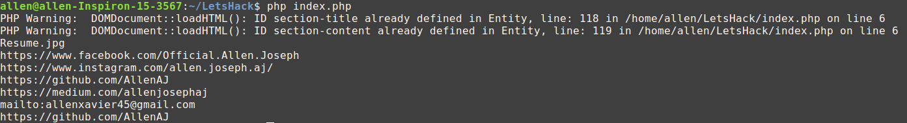

# Link-Extract
#### Using web crawlers to extract links from any website.
<l>
1. "$ git clone https://github.com/AllenAJ/Link-Extract.git"
2. Open Index.php on any text editor.
3. Add any link you would like to extract URL's from in the $START variable.
4. Run the php file using any local server or using cmd line "$ php index.php"
5. Enjoy
</l>

